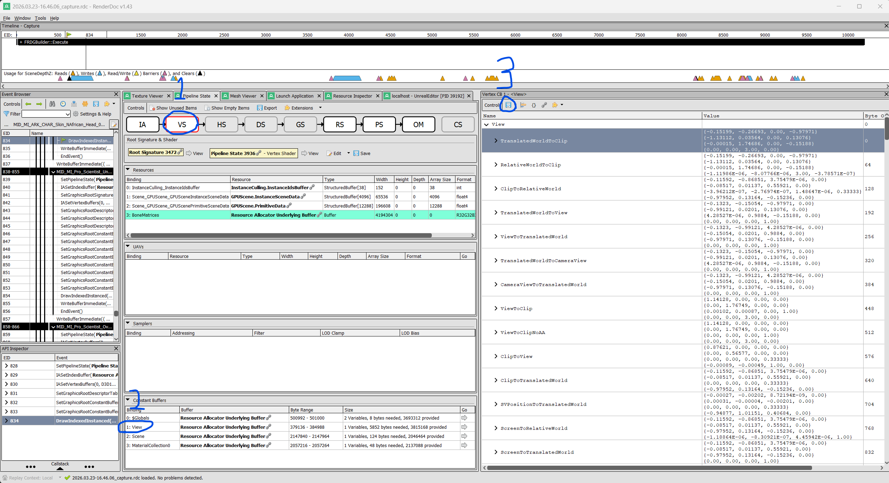

# RenderDoc2obj

Generate face-based `.obj` files from Unreal Engine RenderDoc CSV exports.

This project is aimed at **Unreal Engine / UE5** captures where you export mesh data from RenderDoc. In normal use, the script auto-detects `VS Input` object-space exports from `ATTRIBUTE0.x/y/z`, and auto-detects `VS Output` exports from `SV_Position.x/y/z/w`.

Compared with the original upstream tool, this repo is set up around a folder-based workflow, exports one OBJ per mesh CSV, and reads the full RenderDoc `View` constant-buffer CSV instead of requiring manual copy-paste of matrix rows.

By default the script now uses these folders:

- `TO_EXPORT` for input CSV files
- `EXPORT_OUT` for generated output files

The public repo keeps those folders as empty placeholders. Your local CSV exports, OBJ outputs, RenderDoc captures, virtualenv files, and Python cache files are ignored.

## Credit

This project is based on the original [pizza666/RenderDoc2obj](https://github.com/pizza666/RenderDoc2obj) by Jan-Dirk Lehde.

This repo extends that work with a UE5-focused workflow, per-CSV OBJ export, full `view.csv` constant-buffer parsing, and the additional documentation in this repository.

## Unreal workflow

### 1. Capture a frame in RenderDoc

- Launch or inject into the Unreal game/editor with RenderDoc.
- Capture a frame at the moment the mesh you want is visible.
- In the Event Browser, find the draw call for the mesh.

### 2. Export the mesh CSV

- Open the draw call in **Mesh Viewer**.
- Choose the workflow you want:
  - **VS Input** = object-space mesh data. The script sees `ATTRIBUTE0.x/y/z`, ignores `view.csv`, and writes the raw mesh.
  - **VS Output** = world-space workflow. The script sees `SV_Position.x/y/z/w`, requires `view.csv`, and uses it for reconstruction.
- Right click the chosen table and export it as CSV.
- If the object is split across multiple draws, export each matching mesh CSV.

Put those mesh CSV files into `TO_EXPORT`.

### 3. Export the Unreal view buffer CSV

This step is only needed for the **VS Output** workflow.

For UE5, export the full `View` / `ResolvedView` constant-buffer table as CSV.

The script will extract what it needs automatically, including:

- `View.TranslatedWorldToClip`
- `ViewOriginHigh`
- `ViewOriginLow` when present

In RenderDoc, look here:

- **Pipeline State**
- **Vertex Shader** (or **Mesh Shader** for some UE5 paths)
- **Constant Buffers / CBVs**
- expand the Unreal `View` / `ResolvedView` struct

Then:

- export the full table as CSV
- save that file as `TO_EXPORT/view.csv`

The script reads `TranslatedWorldToClip.row0` through `row3` and any available view-origin fields from that CSV.

Reference screenshot:



The repository does not include sample exported mesh CSVs or RenderDoc captures, because those files are usually large and project-specific.

Example `view.csv`:

```text
Name,Value,Byte Offset,Type
View,,0,FViewConstants
TranslatedWorldToClip,,0,float4x4 (row_major)
TranslatedWorldToClip.row0,"-0.15199, -0.26693, 0.00, -0.97971",,float4
TranslatedWorldToClip.row1,"-1.13112, 0.03564, 0.00, 0.13076",,float4
TranslatedWorldToClip.row2,"-0.00015, 1.74686, 0.00, -0.15188",,float4
TranslatedWorldToClip.row3,"0.00, 0.00, 3.00, 0.00",,float4
ViewOriginHigh,"93.91851, -17.43378, 165.79129",960,float3
ViewOriginLow,"-1.18864E-06, -8.30921E-07, 4.45942E-06",1088,float3
```

## Usage

### Which mode to use

- Normal use: run `python RenderDoc2obj.py` and let the headers decide automatically
- **VS Input** export with `ATTRIBUTE0.x/y/z` = object space = `view.csv` is ignored automatically
- **VS Output** export with `SV_Position.x/y/z/w` = world-space workflow = `view.csv` is required automatically

### Default folder workflow

Put these files into `TO_EXPORT`:

- `view.csv` if you exported **VS Output** data
- one or more mesh CSV exports

Then run:

```bash
python RenderDoc2obj.py
```

Outputs will be written to `EXPORT_OUT`.

If the CSV is `VS Output`, the script will look for `TO_EXPORT/view.csv` automatically and error if it is missing.
If the CSV is `VS Input`, the script will ignore `view.csv` automatically.

### Optional override: skip the `view.csv` transform

Use this only if you want to force raw/object-space export manually. In normal use, `VS Input` exports are detected automatically:

```bash
python RenderDoc2obj.py --no-view-transform
```

### Explicit folders

```bash
python RenderDoc2obj.py --input-dir .\TO_EXPORT --output-dir .\EXPORT_OUT --view .\TO_EXPORT\view.csv
```

### Explicit mesh CSVs

```bash
python RenderDoc2obj.py --view .\TO_EXPORT\view.csv .\TO_EXPORT\mesh_a.csv .\TO_EXPORT\mesh_b.csv
```

## Output files

### Single mesh CSV input

If you exported one mesh CSV, for example `MyMesh.csv`, the script writes to `EXPORT_OUT`:

- `MyMesh.obj`

### Multiple mesh CSV inputs

If you exported multiple mesh CSVs, the script writes one OBJ per CSV to `EXPORT_OUT`.

For example:

- `mesh_a.csv` -> `mesh_a.obj`
- `mesh_b.csv` -> `mesh_b.obj`

The script writes the face-based OBJ export only.

The OBJ file includes triangle faces, and if UVs are detected it also includes `vt` texture coordinates.

Vertex positions are written with the Unreal-to-Houdini/Maya axis conversion baked in:

- rotate `X` by `90`
- scale `Y` by `-1`

This corresponds to remapping exported positions from `(x, y, z)` to `(x, z, y)`.

If the CSV includes an `IDX` column, the script uses it to rebuild shared vertices and indexed triangle faces.

If no usable index data is present, it falls back to grouping every 3 consecutive rows into one face.

This is a **best-effort reconstruction**, not true index-buffer reconstruction, so it may look correct for some captures and wrong for others. Face assembly is always triangle-list based.

